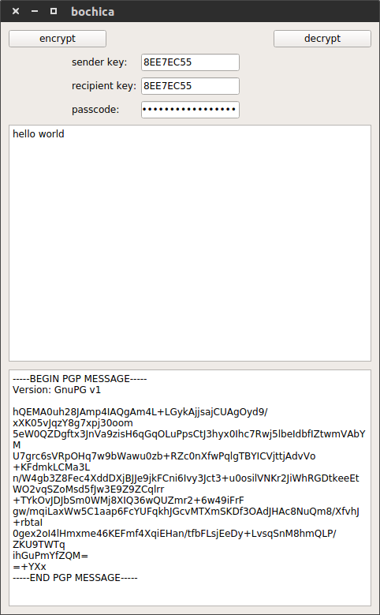
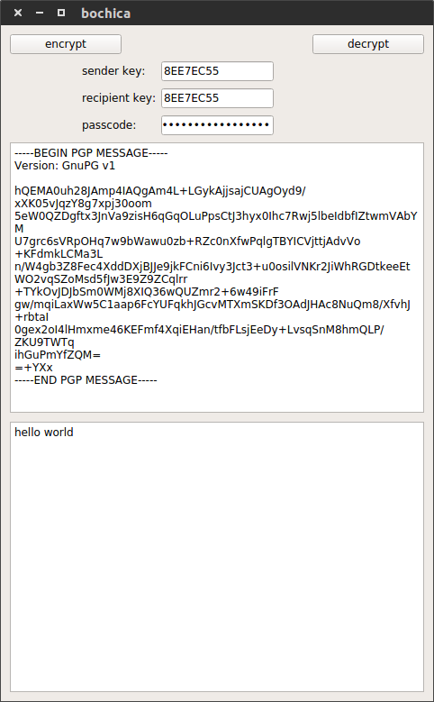

# bochica

GNU Privacy Guard encryption-decryption graphical user interface

# setup

This program works with Python 3 and PyQt5.

```Bash
sudo pip install bochica
```

# usage

```Bash
bochica.py
```

# screenshots

|**encrypt**             |**decrypt**             |
|------------------------|------------------------|
|||
